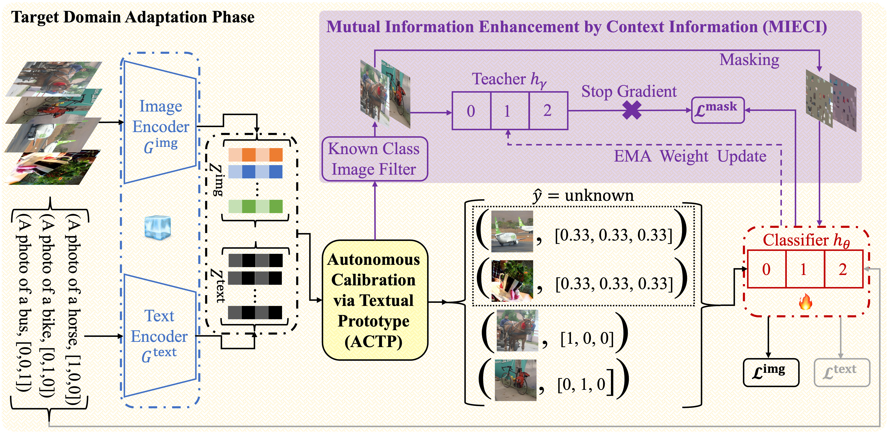

# COCA: Classifier-Oriented Calibration via Textual Prototype for Source-Free Universal Domain Adaptation
This repository contains code for ACCV 2024 paper [COCA: Classifier-Oriented Calibration via Textual Prototype for Source-Free Universal Domain Adaptation](https://arxiv.org/abs/2308.10450).



## Environment Configuration
- We recommend to install the environment through conda and pip. You should start by creating a new environment with Python 3.8. You can accomplish this using the following command:
```
conda create -n COCA python=3.8
```

- **Install PyTorch:** Next, download PyTorch 2.0.0 or later from the official site:

```
conda install pytorch torchvision torchaudio pytorch-cuda=11.8 -c pytorch -c nvidia
```

- **Install [CLIP](https://github.com/openai/CLIP):** Now you are ready to install OpenAI's CLIP model. First, install its dependencies, then the model itself:
```
pip install ftfy regex tqdm
pip install git+https://github.com/openai/CLIP.git
```

- **Install Remaining Dependencies:** Finally, install other necessary dependencies for your project:
```
pip install timm kornia einops scikit-learn
conda install -c pytorch faiss-cpu
```

- We have presented our package versions in `./requirements.txt`.

## Dataset
Our comprehensive experimental research employed three datasets, each involving different category shift scenarios, namely: Partial-set Domain Adaptation (PDA), Open-set Domain Adaptation (OSDA), and Open-partial Domain Adaptation (OPDA). Below, you'll find the specifics of each class split for each scenario. In this context, the notations $\mathcal{C}$, $\mathcal{\bar{C}^s}$, and $\mathcal{\bar{C}^t}$ refer to the common class, source-private class, and target-private class respectively. 

| Datasets    | Class Split| $\mathcal{C}/\mathcal{\bar{C}^s}/\mathcal{\bar{C}^t}$ | |
|-------------| --------   | -------- | -------- |
|             | OPDA       | OSDA     | PDA             |
| Office-Home | 10/5/50    | 25/0/40  | 25/40/0         |
| VisDA-2017  | 6/3/3      | 6/0/6    | 6/6/0           |
| DomainNet   | 150/50/145 |          |                 |

Please manually download these datasets from the official websites, and unzip them to the `./data` directory in the structure detailed below:

```
./data
├── officehome
│   ├── art
|       ├── Alarm_Clock
|       ├── Backpack
|       ├── ...
│   ├── clipart
|       ├── ...
│   ├── product
|       ├── ...
│   ├── realworld
|       ├── ...
├── visda
│   ├── train
|       ├── ...
│   ├── validation
|       ├── ...
├── domainnet
│   ├── painting
|       ├── ...
│   ├── real
|       ├── ...
│   ├── sketch
|       ├── ...
```


### Important Note:
It's critical that the dataset and domain names within the directory are all in lowercase. For example, in `officehome` the correct format would be `[art, clipart, product, realworld]`, in `visda` it should be `[train, validation]`, and for `domainnet` use `[painting, real, sketch]`.

## Source Model Training
If you want to train a source model (16-shot) with CLIP(ViT-B/16) for the open-partial domain adaptation (OPDA), you can execute the following scripts:
```
# Randomly select few-shot image items from the source domain.
bash ./few_shot_items_opda.sh

# Generate few-shot image and text features for the source model training.
bash ./source_features_opda.sh

# Train the source model. 
# The source model is Cross-Modal Linear Probing.
bash ./source_model_cmlp_opda.sh

# The source model is Linear Probe CLIP
bash ./source_model_clip_opda.sh

# The source model is CLIP-Adapter
bash ./source_model_adapter_opda.sh
```

## + COCA
After source model training, you can utilize the plug-and-play COCA method to adapt the classifier to target domains in OPDA:
```
# Cross-Modal Linear Probing (CMLP) + COCA, and the classifier is a single linear layer.
# Results are saved in ./logs/main/cross_modal/linear/
bash ./coca_cmlp_opda.sh

# Linear Probe CLIP + COCA, and the classifier is a single linear layer.
# Results are saved in ./logs/main/uni_modal/linear/
bash ./coca_clip_opda.sh

# CLIP-Adapter + COCA, and the classifier is the adapter module.
# Results are saved in ./logs/main/uni_modal/adapter/
bash ./coca_adapter_opda.sh
```